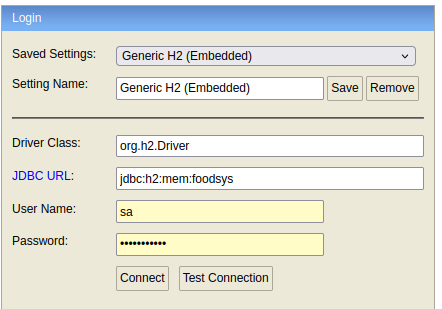

# Tech Challenge FIAP

# 🍽️ FoodSys

## 🚀 Como rodar o projeto

Certifique-se de ter o **Docker** e o **Docker Compose** instalados na sua máquina.

Caso você não tenha, siga esse tuturial: 
## Docker
**https://docs.docker.com/get-started/get-docker/**

## Docker Compose
**https://docs.docker.com/compose/install/**

### 🔧 Passos:

```bash
docker-compose down && docker-compose up --build -d
```

## 💾 Acesso ao banco de dados (H2 Console)

Após iniciar o projeto, acesse o console do banco de dados:

🔗 **URL:** [http://localhost:8080/h2-console/](http://localhost:8080/h2-console/)  
👤 **User Name:** `sa`  
🔐 **Password:** `senhasegura`  
🛢️ **JDBC URL:** `jdbc:h2:mem:foodsys`



## 📚 Documentação da API

A documentação da API está disponível em:

👉 [http://localhost:8080/swagger-ui/index.html](http://localhost:8080/swagger-ui/index.html)


