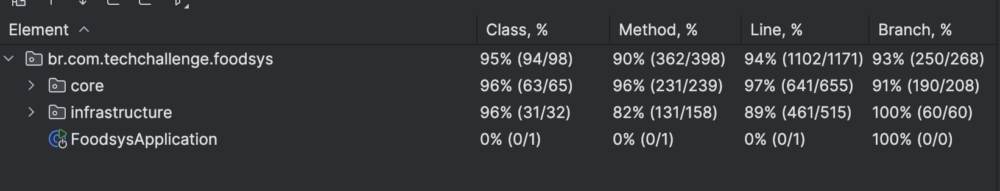

# 🍽️ FoodSys – Tech Challenge - FIAP

## Equipe

- [Gustavo Lima Aliba](https://github.com/GustavoLimaAl)
- [Julio Cesar Salerno da Silva](https://github.com/jcsalerno)
- [Sonia Alves Ribeiro](https://github.com/hopesoh)
- [Stephanie Ingrid Menezes](https://github.com/steingcam)

---

## 1. Introdução

### 📌 Descrição do Problema

O **FoodSys** é um sistema compartilhado de gestão de estabelecimentos para um grupo de restaurantes. Seu objetivo é:

* Reduzir custos com sistemas individuais
* Permitir que os clientes escolham o restaurante com base na comida, não na qualidade do sistema

### 🌟 Objetivo do Projeto

Desenvolver um sistema **backend robusto** com **Spring Boot** que possibilite:

* Gestão de usuários (CRUD + login)
* Gestão de endereços dos usuários (CRUD)

---

## 🎥 Demonstração em Vídeo

Assista à explicação do projeto no YouTube:

👉 Assista no YouTube (https://youtu.be/X0Q_ur34YYk)

---

## 2. Arquitetura do Sistema

### 🛠️ Tecnologias Utilizadas

* **Linguagem**: Java 21 com Spring Framework

    * Spring Web (REST APIs)
    * Spring Data JPA
    * Spring Security (JWT)
    * Lombok
* **Banco de Dados**: H2 (em memória)
* **Containerização**: Docker

    * Imagem base: `eclipse-temurin:21-jdk-jammy`

### 🧱 Camadas da Aplicação

<details>
<summary>V1</summary>

* `config/` – Configurações de segurança, JWT e mensagens
* `controller/` – Camada de controle (REST endpoints)
* `dto/` – Objetos de transferência de dados
* `enums/` – Constantes e enums
* `exception/` – Tratamento global de exceções
* `dominio/` – Entidades de domínio
* `query/` – Consultas especializadas
* `utils/` – Utilitários e validações
* `compartilhado/` – Serviços e componentes reutilizáveis
</details>

<details open>
<summary>V2</summary>

Este projeto segue os princípios da **Clean Architecture** (Arquitetura Limpa), organizando o 
código em camadas bem definidas para manter a independência entre as regras de negócio e as tecnologias externas.

#### **1. Core (Núcleo da Aplicação)**
A base da arquitetura limpa, contendo a lógica de negócio e interfaces principais.

**`domain/entities/`** - Entidades (Camada 1)
- Representam os objetos de negócio principais
- Contêm as regras de negócio mais fundamentais
- Exemplo: `Usuario`, `Restaurante`, `Endereco`

**`domain/usecases/`** - Casos de Uso (Camada 2)
- Implementam as regras de negócio específicas da aplicação
- Orquestram as entidades para realizar operações
- Exemplo: `CriarUsuarioCommand`, `AtualizarRestauranteComando`

**`dtos/`** - Objetos de Transferência de Dados
- Padrão para comunicação externa
- Estruturas de dados para troca de informações entre camadas
- Exemplo: `CriarUsuarioCommandDto`, `AtualizarRestauranteComandoDto`

**`exceptions/`** - Exceções Customizadas
- Exceções específicas do domínio de negócio
- Exemplo: `BadRequestException`, `ForbiddenException`

**`gateways/`** - Interfaces de Acesso (Camada 2)
- Definem contratos para serviços externos
- Interfaces que serão implementadas na camada de infraestrutura
- Exemplo: `UsuarioRepository`, `RestauranteRepository`

**`queries/`** - Consultas
- Classes responsáveis por consultas e listagens
- Exemplo: `ListarRestaurantesQuery`, `ListarUsuariosQuery`

**`utils/`** - Utilitários e Validações
- Classes auxiliares para validações e regras de negócio
- Exemplo: `ValidadorPermissoes`, `ValidarAcessoAdmin`


#### **2. Infrastructure (Infraestrutura)**
Camada externa que implementa as interfaces definidas no core e gerencia dependências externas.

**`infrastructure/api/controllers/`** - Controllers REST
- Controllers do Spring Boot para endpoints HTTP
- **Não são os controllers da Clean Architecture**
- Responsáveis por receber requisições HTTP e delegar para os casos de uso
- Exemplo: `UsuarioController`, `RestauranteController`

**`infrastructure/config/`** - Configurações
- Configurações do Spring Boot
- Exemplo: `SecurityConfig`, `OpenApiConfig`

**`infrastructure/data/repositories/`** - Implementações dos Repositórios
- **Não são os gateways da Clean Architecture**
- Implementações concretas das interfaces definidas em `core/gateways`
- Responsáveis pelo acesso a dados (banco de dados)
- Exemplo: `UsuarioRepositoryImpl`, `RestauranteRepositoryImpl`

### 🔄 Fluxo de Dados

HTTP Request → Controller → Use Case → Entity → Gateway → Repository → Database

↑ ↓

Response ← Controller ← Use Case ← Entity ← Gateway ← Repository ← Database

### Benefícios da Arquitetura

1. **Independência de Frameworks**: O core não depende de Spring Boot ou outras tecnologias
2. **Testabilidade**: Fácil de testar cada camada isoladamente
3. **Manutenibilidade**: Mudanças em uma camada não afetam outras
4. **Flexibilidade**: Pode trocar tecnologias sem afetar a lógica de negócio
5. **Escalabilidade**: Estrutura clara para crescimento do projeto

### 📂 Organização dos Pacotes
```
src/main/java/br/com/techchallenge/foodsys/
├── core/                           
│   ├── domain/
│   │   ├── entities/              # Entidades puras (sem JPA)
│   │   └── usecases/              # Casos de uso
│   ├── dtos/                      # Objetos de transferência
│   ├── enums/
│   ├── exceptions/                # Exceções customizadas
│   ├── gateways/                  # Interfaces de acesso
│   ├── queries/                   # Consultas
│   ├── shared/                    # Compartilhados (apenas utilidades puras)
│   └── utils/                     # Utilitários de domínio (sem infraestrutura)
└── infrastructure/                # Implementações externas
     ├── api/
     │   └── controllers/           # Controllers REST
     ├── config/                    # Configurações
     ├── data/                      # Camada de dados
     │   ├── entities/              # Entidades JPA/MongoDB
     │   └── repositories/          # Implementações dos repositórios
     └── services/                  # Serviços de infraestrutura

```

</details>

---

## 3. Endpoints da API

| Endpoint                              | Método | Descrição                     |
| ----------------------------------- | ------ | ----------------------------- |
| /usuarios                           | POST   | Criação de usuários           |
| /usuarios/{usuarioId}               | PUT    | Atualização de usuários       |
| /usuarios?ativo=                    | GET    | Listagem de usuários          |
| /usuarios/{usuarioId}               | DELETE | Desativação de usuário        |
| /login                             | POST   | Autenticação                  |
| /login/atualiza-senha              | PUT    | Atualização de senha          |
| /enderecos                         | POST   | Criação de endereço           |
| /enderecos/{enderecoId}            | PUT    | Atualização de endereço       |
| /enderecos/usuario/{usuarioId}     | GET    | Listagem de endereços         |
| /enderecos                        | DELETE | Exclusão de endereço          |
| /restaurantes/{restauranteId}/itens | POST   | Criação de itemDoCardapio              |
| /restaurantes/{restauranteId}/itens | GET    | Listagem de pratos por restaurante |
| /restaurantes/{restauranteId}/itens/{itemId} | GET    | Buscar itemDoCardapio por ID           |
| /restaurantes/{restauranteId}/itens/{itemId} | PUT    | Atualização de itemDoCardapio          |
| /restaurantes/{restauranteId}/itens/{itemId}| DELETE | Exclusão de itemDoCardapio             |
| /restaurantes/{restauranteId}/itens/{itemId}/foto | POST   | Upload de foto do itemDoCardapio       |

### 📄 Documentação Swagger

Acesse a documentação interativa da API:

🔗 [http://localhost:8080/swagger-ui/index.html](http://localhost:8080/swagger-ui/index.html)

---

### Documentação Geral

🔗  [Especificação do projeto (OneDrive)](https://1drv.ms/w/c/7b17063f7fd73beb/EXioKubFloRKsuFermXOIA0BoeAXyzu8piBDhI5WG31c6g?e=M8N30f)

---

## 4. Configuração do Projeto

### 🐳 Docker

* **Imagem base**: `eclipse-temurin:21-jdk-jammy`
* **Porta**: 8080 (exposta como 8082)
* **Variáveis de ambiente**:

    * Banco H2 (em memória)
    * Credenciais Admin:

        * `Usuário`: `admin`
        * `Senha`: `12345`

### ▶️ Execução Local

#### Pré-requisitos

* Docker **https://docs.docker.com/get-started/get-docker/**
* Docker Compose **https://docs.docker.com/compose/install/**

#### Como Rodar o Projeto

```bash
# Clone o repositório
git clone https://github.com/FiapPos/tech-challenge-fiap-backend.git

# Entre na pasta do projeto
cd tech-challenge-fiap-backend

# Inicie o serviço via Docker Compose
docker-compose up -d foodsys-api
```

### 📃 Acesso ao Banco H2

* URL: [http://localhost:8080/h2-console](http://localhost:8080/h2-console)
* JDBC URL: `jdbc:h2:mem:foodsys`
* Usuário: `sa`
* Senha: `senhasegura`

---

### 📘 Como configurar o MongoDB usando MongoDB Compass e converter em imagem

## ✅ 1. Baixando e instalando o MongoDB Compass

1. Acesse o site oficial:
   👉 [https://www.mongodb.com/try/download/compass](https://www.mongodb.com/try/download/compass)

2. Selecione a versão para seu sistema operacional (ex: Linux .deb, Windows ou macOS)

3. Clique em **"Download"** e instale normalmente no seu sistema.

---

## 🔌 2. Conectando ao banco de dados

1. Abra o MongoDB Compass

2. No campo **"Connection string"**, insira a URI do seu banco. Exemplo para local:

   ```
   mongodb://localhost:27017/
   ```

3. Clique em **"Connect"**

---

## 🔍 3. Acessando a coleção que armazena a imagem

1. Na lateral esquerda, clique no nome do seu **banco de dados** (ex: `techchallenge`)

2. Clique na **coleção** onde a imagem está armazenada (ex: `pratos`)

3. Procure pelo documento que contém a imagem. Você verá um campo como:

   ```json
   "foto": {
     "$binary": {
       "base64": "iVBORw0KGgoAAAANSUhEUgAAAIAAAACAC...",
       "subType": "00"
     }
   }
   ```

---

## 🧬 4. Convertendo o campo `foto` em imagem real

1. Copie **somente o valor `base64`** (aquele texto enorme do tipo `iVBORw0K...`)

2. Acesse o site:
   👉 [https://codebeautify.org/base64-to-image-converter](https://codebeautify.org/base64-to-image-converter)

3. Cole o código no campo **"Paste your Base64 string"**

4. Clique em **"Generate Image"**

5. A imagem será renderizada logo abaixo e você poderá clicar em **"Download"** se quiser salvar.

---

## 5. Qualidade do Código

### 🧠 Princípios SOLID

* **SRP**: Classes com responsabilidade única
* **OCP**: Aberto para extensão, fechado para modificação
* **LSP**: Substituibilidade de subclasses
* **ISP**: Interfaces específicas para cada cliente
* **DIP**: Inversão de dependência

### 🧰 Padrões de Projeto

* Repository Pattern
* DTO Pattern
* Command Pattern
* Exception Handling centralizado

### ✅ Boas Práticas

* Nomenclatura RESTful
* Validações robustas
* Documentação Swagger
* Segurança com JWT

---

## 6. Testes

### 📦 Coleção Postman

Você pode testar a API importando a coleção disponível em:

🔗 [techchallenge.foodsys.postman\_collection.json](https://github.com/FiapPos/tech-challenge-fiap-backend/blob/main/techchallenge.foodsys.postman_collection.json)

### Cobertura

****

---
## ✅ Status do Projeto


[](https://github.com/FiapPos/tech-challenge-fiap-backend/blob/main/techchallenge.foodsys.postman_collection.json)

---